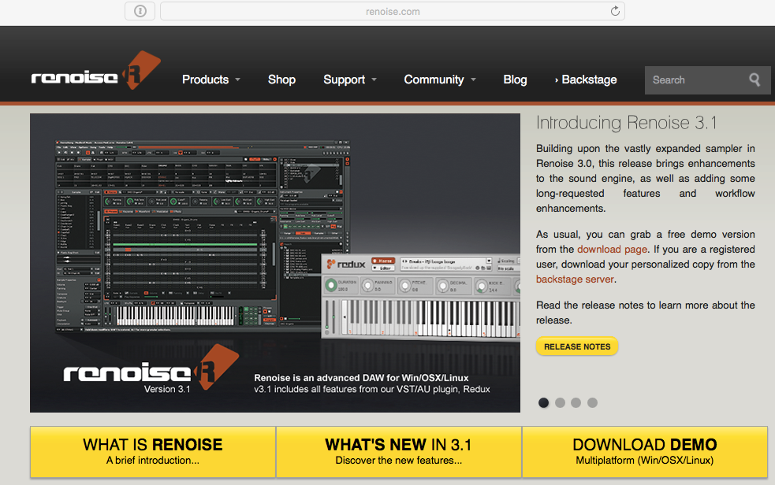
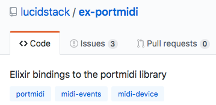

<br>

## Elixir Hot-Reloading & MIDI notes generation

https://github.com/thbar/demo-elixir-reloading-music

---

# Elixir?

Elixir est un langage dynamique et fonctionnel conçu pour construire des applications scalables et faciles à maintenir.

Elixir s'appuie sur la VM Erlang, connue pour sa capacité à faire tourner des systèmes distribués, tolérants à la panne, avec une faible latence, tout en étant utilisé avec succès pour développer pour le web et dans le domaine du logiciel embarqué.

---

## Hot-reloading du code?

---

### Comment faire un exemple très simple de hot-reloading de code?

---

### Comment rendre cet exemple intéressant?

---

### Génération de sons en live :smile:

---

### Comment générer une seule note?

---

# Renoise



---

# PortMidi (librairie C)


---

# Bindings Elixir pour PortMidi



---

```elixir
# Start a process for MIDI event queue
{:ok, pid} = PortMidi.open(:output, "Renoise MIDI-In")

note = 48 # C-4
velocity = 127

# Send "NOTE ON"
PortMidi.write(pid, {0x90, note, velocity})

# Send "NOTE OFF"
PortMidi.write(pid, {0x80, note})
```

---

### Comment construire une boucle pour la musique?

---

* `GenServer`
* `Process.send_after(xxx)`

---

```elixir
defmodule MidiPlayer do
  use GenServer

  def start_link do
    {:ok, device} = PortMidi.open(:output, "Renoise MIDI-In")
    tick_period = 50
    Process.send_after(:midi, {:tick}, tick_period)
    GenServer.start_link(__MODULE__, %{
      current_tick: -1,
      device: device,
      tick_period: tick_period
    }, name: :midi)
  end
  # SNIP
end
```

---

```elixir
defmodule MidiPlayer do
  def handle_info({:tick}, state) do
    Process.send_after(:midi, {:tick}, state.tick_period)
    current_tick = Map.fetch!(state, :current_tick) + 1

    show_visual_feedback(current_tick)
    play_notes(state.device, current_tick)

    {:noreply, %{state | current_tick: current_tick}}
  end
end
```

---

```elixir
def play_notes(device, current_tick) do
  notes = [0x54, 0x57, 0x5B, 0x60]
  delay = 4

  if rem(current_tick, delay) == 0 do
    index = rem(div(current_tick, delay), Enum.count(notes))
    note = Enum.at(notes, index)
    PortMidi.write(device, {0x90, note, volume})
    Process.send_after(:midi, {:note_off, note}, 50 * 2)
  end
end
```

---

### I CAN HAZ RELOADING?

```elixir
Code.eval_file("music.exs")
```

---

### Comment réagir aux modifications du fichier source?

```elixir
defmodule Monitor do
  use ExFSWatch,
    dirs: ["music.exs"],
    listener_extra_args: "--latency=0.0"

  def callback(_file_path, _events) do
    Code.eval_file("music.exs")
  end
end

Monitor.start
```

---

### Révélation

Le code et la donnée de GenServer sont séparés.

Le rechargement du code d'un GenServer **ne modifie pas son état données**.

=> On peut conserver la position de la musique (ticks) entre les rechargements.

---

```
+-----------------+   +----------------------+
| (reloable) code | + | état préservé (tick) |
+-----------------+   +----------------------+

                  |   |
                   \ /

         +---------------------+    +----------+    +---------+
         | ex-portmidi process | -> | portmidi | -> | renoise |
         +---------------------+    +----------+    +---------+
```

---

### DEMO
