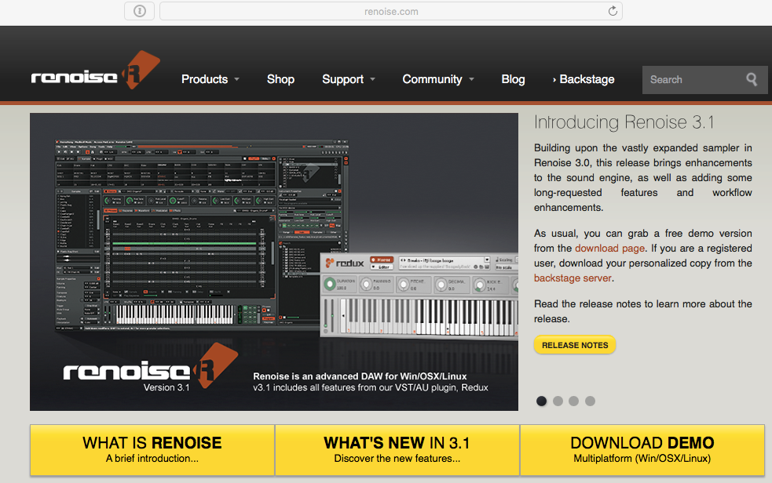
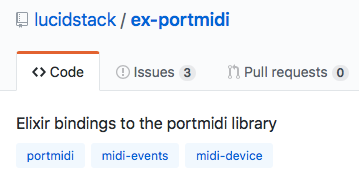

<br>

## Elixir Hot-Reloading & MIDI notes generation

https://github.com/thbar/demo-elixir-reloading-music

---

### How to implement a very simple Elixir code hot-reloading example?

---

### How to make it interesting?

--- 

### Live sound events generation :smile:

---

### How to generate one note?

---

# Renoise (music production system)



---

# PortMidi (C library)


---

# Elixir bindings for PortMidi



---

```elixir
# Start a process for MIDI event queue
{:ok, pid} = PortMidi.open(:output, "Renoise MIDI-In")

note = 48 # C-4
velocity = 127

# Send "NOTE ON"
PortMidi.write(pid, {0x90, note, velocity})

# Send "NOTE OFF"
PortMidi.write(pid, {0x80, note})
```

---

### How to build a music loop?

---

* `GenServer`
* `Process.send_after(xxx)`

--- 

```elixir
defmodule MidiPlayer do
  use GenServer
  
  def start_link do
    {:ok, device} = PortMidi.open(:output, "Renoise MIDI-In")
    tick_period = 50
    Process.send_after(:midi, {:tick}, tick_period)
    GenServer.start_link(__MODULE__, %{
      current_tick: -1,
      device: device,
      tick_period: tick_period
    }, name: :midi)
  end
  # SNIP
end
```

---

```elixir
defmodule MidiPlayer do
  def handle_info({:tick}, state) do
    Process.send_after(:midi, {:tick}, state.tick_period)
    current_tick = Map.fetch!(state, :current_tick) + 1
    
    show_visual_feedback(current_tick)
    play_notes(state.device, current_tick)
    
    {:noreply, %{state | current_tick: current_tick}}
  end
end
```

---

```elixir
def play_notes(device, current_tick) do
  notes = [0x54, 0x57, 0x5B, 0x60]
  delay = 4
  
  if rem(current_tick, delay) == 0 do
    index = rem(div(current_tick, delay), Enum.count(notes))
    note = Enum.at(notes, index)
    PortMidi.write(device, {0x90, note, volume})
    Process.send_after(:midi, {:note_off, note}, 50 * 2)
  end
end
```

---

### I CAN HAZ RELOADING?

```elixir
Code.eval_file("music.exs")
```

---

### How to react to file change?

```elixir
defmodule Monitor do
  use ExFSWatch, 
    dirs: ["music.exs"],
    listener_extra_args: "--latency=0.0"
  
  def callback(_file_path, _events) do
    Code.eval_file("music.exs")
  end
end

Monitor.start
```

---

### AHA MOMENT

GenServer reloading **keeps the state across reloads**.

=> We can keep the "current music tick" between reloads.

---

```
+-----------------+   +------------------------+
| (reloable) code | + | preserved state (tick) |
+-----------------+   +------------------------+

                  |   |
                   \ /

         +---------------------+    +----------+    +---------+
         | ex-portmidi process | -> | portmidi | -> | renoise |
         +---------------------+    +----------+    +---------+
```

---

### DEMO